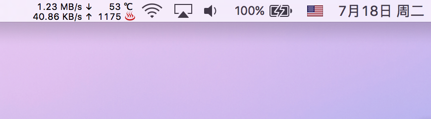

# Statbar

Statbar is a menu bar app for macOS  that monitors following metrics:

- Upload and download speeds.
- CPU temperature.
- Fan speed.

This app is based on following projects:

- [Up-Down](https://github.com/gjiazhe/Up-Down)
- [SMCKit](https://github.com/beltex/SMCKit)

But unlike Up-Down, this app does not rely on [nettop](https://developer.apple.com/legacy/library/documentation/Darwin/Reference/ManPages/man1/nettop.1.html). All metrics are gathered with system API,  which is more efficient.
